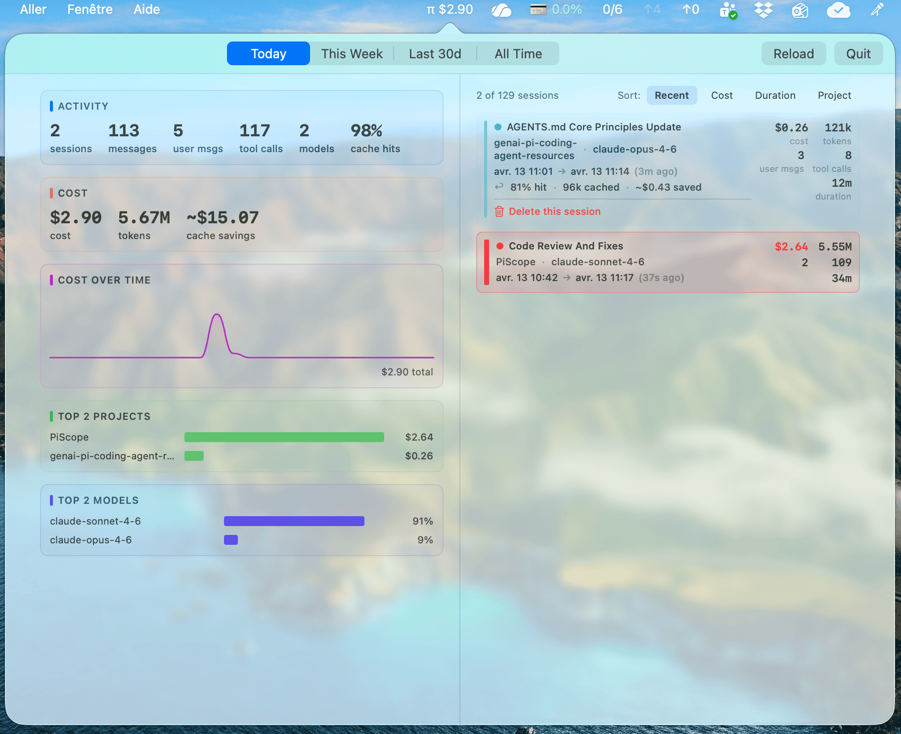

# PiScope

A lightweight macOS menu bar app to monitor your [pi coding agent](https://pi.dev) sessions — costs, tokens, models, and projects at a glance.




## Inspirations

- [Bandwidther](https://github.com/simonw/bandwidther) — single-file SwiftUI app built with plain `swiftc`, no Xcode
- [Claudoscope](https://github.com/cordwainersmith/Claudoscope) — session analytics for Claude Code

## Table of Contents

- [What it shows](#what-it-shows)
- [How it works](#how-it-works)
- [Build & run](#build--run)
- [Auto-start on login](#auto-start-on-login)
- [Known limitations](#known-limitations)
- [Metrics explained](#metrics-explained)

## What it shows

**Menu bar:** `π $0.42` — today's total spend, updated every 30 seconds.

**Click to open a popover with two panels:**

- **Left — Overview:** activity stats (sessions, messages, user messages, tool calls, models, cache hit %), cost summary (cost, tokens, estimated cache savings), cost-over-time sparkline, top projects by spend, top models by usage share. All scoped to a time range you pick: **Today / This Week / Last 30d / All Time**.

- **Right — Sessions:** full session list for the selected range, sortable by **Recent**, **Cost**, **Duration**, or **Project**. Each row shows name, project, model, start→end timestamps with relative age, cost, tokens, user message count, tool calls, duration, and — on hover — cache hit %, cached tokens, estimated savings, and a **Delete this session** button.

## How it works

PiScope scans `~/.pi/agent/sessions/` every 30 seconds on a background thread using an incremental parser: each file's modification date is checked first, and only new or changed files are read and re-parsed. Unchanged files are served from an in-memory cache. The **Reload** button forces a full re-parse by clearing the cache. All processing is local; no data leaves your machine.

## Build & run

Requires macOS 14+ (Sonoma), Swift 5.9+ and the Xcode command-line tools (`xcode-select --install`).

```bash
swiftc -parse-as-library -framework SwiftUI -framework AppKit -o PiScope PiScopeApp.swift
./PiScope
```

## Auto-start on login

A ready-made `LaunchAgent` plist is included in this repository.

1. Edit `com.github.vbehar.PiScope.plist` and replace `/path/to/PiScope` with the absolute path to your compiled binary (e.g. `$(which PiScope)`).
2. Copy it to `~/Library/LaunchAgents/`:
   ```bash
   cp com.github.vbehar.PiScope.plist ~/Library/LaunchAgents/
   ```
3. Load it immediately (no reboot needed):
   ```bash
   launchctl load ~/Library/LaunchAgents/com.github.vbehar.PiScope.plist
   ```

PiScope will now start automatically on every login. To disable it:
```bash
launchctl unload ~/Library/LaunchAgents/com.github.vbehar.PiScope.plist
```

## Known limitations

- **Cache savings are Anthropic-specific.** The formula `cacheReadCost × 9` assumes Anthropic's ~10 % cache-read pricing and will be inaccurate for other providers.
- **Model stats use per-session primary model.** Global model breakdowns attribute a session's full cost to its dominant model, not to each individual message's model.

## Metrics explained

| Metric | Definition |
|--------|------------|
| **Cache hit rate** | `cacheReadTokens ÷ (rawInputTokens + cacheReadTokens + cacheWriteTokens)` — the fraction of context tokens served from Anthropic's prompt cache. |
| **Cache savings** | Estimated money saved by caching. Anthropic charges ~10% of the normal input price for cache reads, so each dollar paid for a cache read saves ~$9 that would otherwise have been charged at the full input rate. Formula: `cacheReadCost × 9`. This is Anthropic-specific and approximate. |
| **Tokens** | Total tokens per session = `usage.totalTokens` from each assistant message (input + output + cache). |
| **Duration** | Time between the first `session` entry timestamp and the last assistant `message` timestamp in the JSONL file. |
